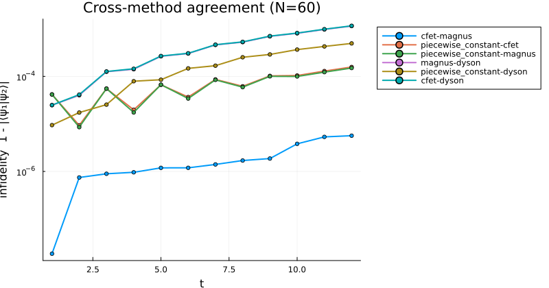
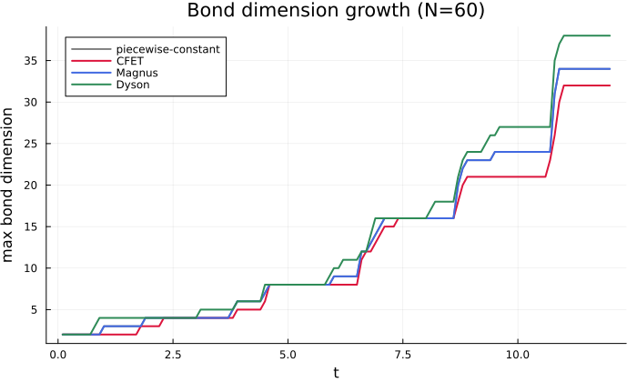
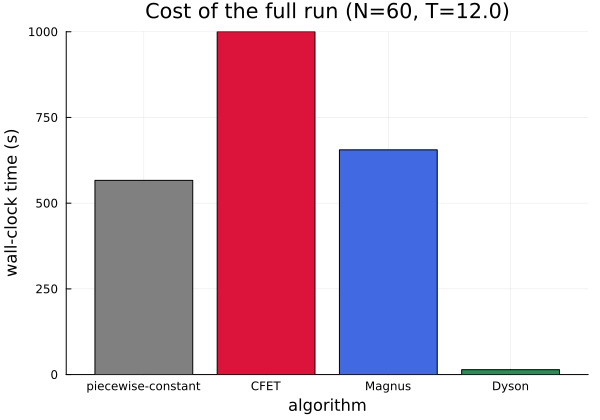

```@meta
CurrentModule = ITensorTDMPO
```

# Large-system benchmarks

Every other benchmark in this documentation checks accuracy against an
independent dense reference, which is only possible on small chains —
dense diagonalization is exponential in system size. This page checks a
different thing: that all four algorithms, independently implemented
from genuinely different mathematical constructions (a local TDVP
sweep, a Dyson-series MPO, an exponentiated Magnus generator, and a
commutator-free product of exponentials), continue to agree with each
other at a production-relevant system size, and reports what each one
actually costs there.

Model throughout this page: the same driven transverse-field Ising
chain used elsewhere in this documentation — `H(t) = -Σᵢ SzᵢSzᵢ₊₁ - g(t)
Σᵢ Sxᵢ` with `g(t) = sin(3t) + 0.5` — at `N = 60` sites, evolved to
`t = 12` with `dt = 0.1` (120 steps), `cutoff = 1e-10`, `maxdim = 200`.
`"cfet"` uses order 4, `"magnus"` order 2, `"dyson"` order 2 (and,
separately below, order 3); `"piecewise_constant"` does not take an
order.

## Cross-method agreement

Pairwise infidelity `1 - |⟨ψ₁|ψ₂⟩|` between every pair of methods,
checked every 10 steps:



Maximum infidelity over the full trajectory, for every pair:

| pair | max infidelity |
|---|---|
| `cfet` – `magnus` | `5.6e-6` |
| `piecewise_constant` – `magnus` | `1.5e-4` |
| `piecewise_constant` – `cfet` | `1.6e-4` |
| `piecewise_constant` – `dyson` | `4.9e-4` |
| `magnus` – `dyson` | `1.14e-3` |
| `cfet` – `dyson` | `1.16e-3` |

This lands exactly where the methods' documented convergence orders
predict. `cfet`-`magnus` — the two ~4th-order methods — are the
tightest pair by more than an order of magnitude. `piecewise_constant`
(2nd order) disagrees with them at the `~1.5e-4` level, and every pair
involving `dyson` at order 2 (whose own documented global order is
lower still) is the loosest, at `4.9e-4`–`1.16e-3`. None of this is a
discrepancy to explain away — it is different methods at different
formal orders disagreeing by amounts consistent with those orders, at
`N = 60`, which is exactly what "the FSM construction's
size-extensivity holds at production scale" should look like. The
direct (non-FSM) Dyson construction this replaced would not show this:
its error grows sharply with chain length (see
[Scope and limitations](@ref)), so this same check at `N = 60` would
have been dominated by that growth rather than by the order differences
actually visible here.

### Dyson order 2 vs order 3

Because [`dyson_evolve`](@ref) is cheap enough at this bond dimension to
rerun almost for free (see [Cost](@ref) below), raising its order gives
a direct, no-extra-infrastructure check that the FSM construction's
`order` parameter behaves correctly at this system size, not just at
the small chains used elsewhere in this documentation:

| pair | max infidelity |
|---|---|
| `dyson`(order 3) – `magnus` | `2.1e-6` |
| `dyson`(order 3) – `cfet` | `8.6e-6` |
| `dyson`(order 2) – `magnus` | `1.1e-3` |
| `dyson`(order 2) – `cfet` | `1.2e-3` |

Raising the order from 2 to 3 tightens agreement with the ~4th-order
methods by very close to two orders of magnitude — `dyson`(order 3)
vs. `magnus` (`2.1e-6`) is in fact tighter than `cfet` vs. `magnus`
itself (`5.6e-6`, above) — while the wall-clock cost barely moves:
**38.7 s**, versus 14.3 s at order 2 and 655–1000 s for `cfet`/`magnus`.
That is the FSM construction's `order` parameter doing exactly what it
is documented to do, confirmed at `N = 60` rather than only on the
small chains used elsewhere in this documentation.

## Bond dimension growth



All four methods track each other closely and grow in the same
step-like pattern — expected, since they are all representing the same
physical state to comparable accuracy. `dyson` runs consistently at or
above the others toward the end of the trajectory, consistent with its
lower formal order needing slightly more bond dimension at fixed
truncation `cutoff` to reach the same state-fidelity target.

## Cost



| method | wall-clock (120 steps) |
|---|---|
| `piecewise_constant` | 566.6 s |
| `cfet` (order 4) | 1000.4 s |
| `magnus` (order 2) | 655.5 s |
| `dyson` (order 2) | **14.3 s** |

The ~40–70× gap is architectural, not incidental: `piecewise_constant`,
`magnus`, and `cfet` all evolve the state by one or more internal TDVP
sweeps per step (`cfet` uses two exponentials per step, the most
expensive of the three here), while [`dyson_evolve`](@ref) applies a
single MPO to the state via `apply` — no iterative sweep at all. At the
bond dimensions this model reaches (~30–38), that architectural
difference dominates over any per-order cost increase. This does not
change the accuracy guidance elsewhere in this documentation (`cfet`
and `magnus` remain more accurate per step, see
[Scope and limitations](@ref)); it does mean [`dyson_evolve`](@ref) is
worth considering wherever its accuracy at a given order is sufficient,
particularly since raising its order remains inexpensive (see above).

## Cost scaling with system size

Separate, shorter run (`T = 3`, `dt = 0.1`, 30 steps) across three
system sizes, to check that cost scales reasonably with `N` rather than
blowing up:

| N | `piecewise_constant` | `cfet` | `magnus` | `dyson` |
|---|---|---|---|---|
| 20 | 19.1 s | 30.4 s | 21.6 s | 1.6 s |
| 40 | 44.9 s | 64.2 s | 44.6 s | 1.6 s |
| 60 | 63.7 s | 107.9 s | 64.5 s | 2.7 s |

Roughly linear in `N` for all four methods over this range, at the low
bond dimensions this shorter, lower-drive-amplitude run reaches.
